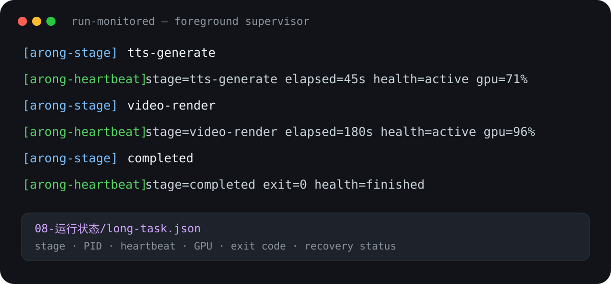

# Arong Content Engine

[](https://github.com/alonzodeheart-cmd/arong-content-engine/actions/workflows/ci.yml)
[](https://github.com/alonzodeheart-cmd/arong-content-engine/releases)
[](LICENSE)

> A reviewable and resumable content-production Skill for Codex and other `SKILL.md`-compatible agents. It turns verified creator knowledge into an article, one 3–5 minute vertical video, and a seven-platform publishing package without silently crossing human approval gates. [English documentation](docs/README.en.md)

标题、开头、封面、AI 痕迹检查，单独调用都不难。难的是把它们接起来：文章改了，视频稿有没有同步？用户批准的是哪一版？配音跑了半小时，是仍在工作，还是已经卡住？

Arong Content Engine 把这些分散环节整理成一条有审批门、可恢复的内容生产线。它从创作者已经确认的个人观点或真实经历出发，产出文章、一版 3–5 分钟 9:16 竖版长视频和七平台发布包。

它不会替用户决定选题，不会把 AI 推导冒充本人经历，也不会自动发布。



查看 [三分钟可复现案例](examples/portable-demo/README.md) 和 [实际 Remotion 渲染样片](docs/demo/arong-content-engine-demo.mp4)。

## 它解决什么

- **选题不越权**：用户给题就登记；用户要求找题时，只读搜索私人来源，先给候选和证据，等用户选择。
- **写作不代填人生**：先做内容诊断，再围绕关键经历、证据、立场和方向多轮共创；素材不足时保留待确认，不用空话补出一篇“完整文章”。
- **专项 Skill 真正串联**：标题、开头、封面、AI 痕迹、口播流畅度和商业内容风险分别调用对应 Skill，并保留诊断与批准记录。
- **文章与视频分开写**：视频稿不是文章摘要，而是重新组织成适合口播的 3–5 分钟主稿。
- **只做一版正式视频**：1080×1920、9:16，不派生横版和短切片。
- **长任务看得见**：配音、字幕、Remotion 渲染和打包持续输出前台心跳；断线后可从状态文件判断是在运行、等待、失败还是已经完成。
- **事实源不会漂移**：本地 Markdown、审批哈希、运行状态和生成清单共同记录每一步；飞书等在线文档只作为审阅镜像。

## 与 dbskill 的关系

这个仓库不替代 dbskill。它负责调度整条流程，在正确的阶段调用专项能力：

| 阶段 | 专项 Skill | 默认行为 |
| --- | --- | --- |
| 文章初稿 | `dbs-ai-check` | 只诊断；用户同意后才修改正文 |
| 标题 | `dbs-xhs-title` | 单独生成、单独选择 |
| 开头 | `dbs-hook` | 先诊断当前开头，再给前 5 秒候选 |
| 封面 | `dbs-cover` | 标题是第一视觉主体，按平台重新排版 |
| 视频稿 | `dbs-script-flow`、`dbs-ai-check` | 检查衔接、密度和 AI 痕迹 |
| 商业内容 | `dbs-content-risk-check` | 项目、商品、服务、价格、收益、导流等内容必须审查 |
| 公众号 | `dbs-wechat-html` | 固定输出极简黑白粘贴版，不改 Markdown 正文 |

如安装了 [`rn-motion-director`](https://github.com/Pluviobyte/rnskill/tree/main/skills/rn-motion-director)，视频阶段会调用它设计运动命题与 Anti-PPT 检查；未安装时使用仓库内置的 [视觉生产契约](references/visual-production-contract.md)，并明确记录外部检查未执行。

## 工作流

1. 用户确认选题。
2. Agent 诊断受众、冲突、产品关系、形式和证据边界。
3. Agent 先给结构，只对关键缺口一次问一个问题；连续获得 2–4 个有效回答后主动推进草稿。
4. 用户审阅文章，批准后锁定哈希并生成公众号极简黑白 HTML。
5. 标题、开头、封面分别调用专项 Skill，分别由用户确认。
6. 将文章重写为一版 3–5 分钟竖版视频稿；商业内容先经过发布风险审查。
7. 写运动命题和节拍图，通过 Motion-first / Anti-PPT 硬门。
8. 前台监工完成本人音色配音、词级字幕、正式长片、验证和七平台发布包。
9. 用户人工发布；24 小时、7 天和 30 天后用真实数据复盘。

完整约束见 [工作流契约](references/workflow-contract.md)、[视觉生产契约](references/visual-production-contract.md) 和 [权限与证据边界](references/permissions-and-evidence.md)。

## 长任务不会“丢到后台”

正式生产使用：

```powershell
node scripts/engine.mjs run-monitored --task "<任务目录>" --heartbeat 45
```

它会把子进程日志持续显示在当前终端，并写入：

- `08-运行状态/long-task.json`：当前阶段、PID、心跳、静默时长、退出码和恢复建议；
- `08-运行状态/run-safe.log`：完整运行日志。

断线或重新打开任务后先查询：

```powershell
node scripts/engine.mjs monitor-status --task "<任务目录>"
```

如果原进程仍存活，就继续观察，不重复启动。连续三个心跳没有新日志只触发检查，不会擅自杀进程或重跑 TTS。

## 安装

```bash
npx -y skills add alonzodeheart-cmd/arong-content-engine -g --all
```

也可以克隆仓库后，把目录链接或复制到兼容 `SKILL.md` 的 Agent 技能目录。

### 首次配置

1. 将 `config/profile.example.json` 复制为 `config/profile.local.json`。
2. 填写创作者名、内容任务目录和私人的来源地图。
3. 如需本地视频，填写 IndexTTS2、音色参考、发音词典和字幕对齐脚本。
4. 在 `runtime/remotion/` 执行 `npm install`。
5. 安装上表所需 dbskill；思想型内容可不调用商业风险审查，但商业内容缺少审查会被状态机拦住。
6. 运行诊断：

```powershell
node scripts/engine.mjs doctor
```

`FULL` 表示文章、配音、字幕和竖版视频环境完整；`WRITING_ONLY` 表示仍可做选题与写作，但视频阶段会停止并列出缺失项。

## 使用

给定素材：

```text
使用 $arong-content-engine：
把这段真实经历做成一篇文章和一条 3–5 分钟竖版视频。
```

从私人思考库找题：

```text
使用 $arong-content-engine：
从我的思考库推荐 5 个选题，先给原句和来源，等我选择，不要开始写文章。
```

继续已有任务：

```powershell
node scripts/engine.mjs status --task "<任务目录或 task_id>"
```

只执行返回结果中的 `next_action`，不要跳过用户审批门。

## 封面与视频默认效果

- 封面采用主题背景加 2–4 行大字，文字是第一视觉主体；背景仍需辨认出人物、场景或关键物件。
- 明亮背景可以压暗；夜景和暗场先检查可见度，必要时提亮阴影与中间调，不能压成纯黑。
- 视频画面必须对应当前段落。真实截图、证据、数据、流程和相关图解优先，不用无关学生、办公室、钞票或豪车素材填空。
- 至少 80% 的节拍应有淡入和平移之外的可见状态变化；禁止整片反复呼吸缩放、循环弹跳和纯字幕轮播。
- 只生成一版无水印 9:16 正式长片，抖音、视频号、小红书视频和 B 站复用；各平台只调整标题、简介和必要的封面比例。

## 验证

```powershell
node scripts/engine.mjs audit-skill
node scripts/engine.mjs self-test
node scripts/engine.mjs verify-case --task "<任务目录>"
```

只有结果为 `PASS` 才表示对应检查通过。`WAITING_USER` 是真实审批门，不是程序失败，也不能伪装成完成。

## 隐私与边界

- `profile.local.json`、`source-map.local.md`、本地 TTS 路由、声音参考和内容任务默认被 `.gitignore` 排除。
- 搜索私人资料默认只读；“现在帮我搜索”不等于授权收录、移动或合并知识库。
- 不自动发布、发消息、购买、投放或收费。
- 不保证流量、收益或平台结果；平台规则、价格和产品能力等易变化信息应在发布前核对官方来源。

## License

[MIT](LICENSE)
